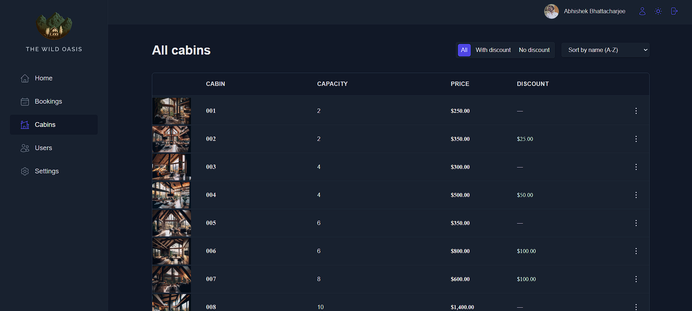
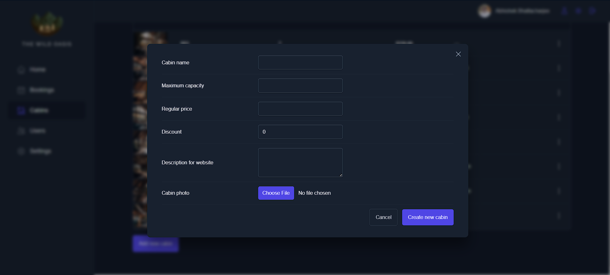

# THE WILD OASIS

Dashboard designed for hotel employees to efficiently manage bookings, cabins, and various hotel settings.

## FEATURES

### 1. Dashboard

### 2. Bookings

### 3. Cabins

### 4. Create new user

### 5. Hotel settings

### 6. User settings

### 7. Checkin

### 8. Light mode

## Libraries Used

- [react-query](https://react-query.tanstack.com/): A React library for managing, caching, and updating asynchronous state.
- [react-hook-form](https://react-hook-form.com/): Performant, flexible, and extensible forms in React.
- [react-toast](https://www.npmjs.com/package/react-toast): A lightweight toast notification library for React.
- [react-router-dom](https://reactrouter.com/web/guides/quick-start): Declarative routing for React.js.
- [recharts](https://recharts.org/): A composable charting library for building charts with React and D3.
- [styled-components](https://styled-components.com/): For styling purposes

## Usage

For initial access, use the following credentials:

- **Email**: test@test.com
- **Password**: test1234
